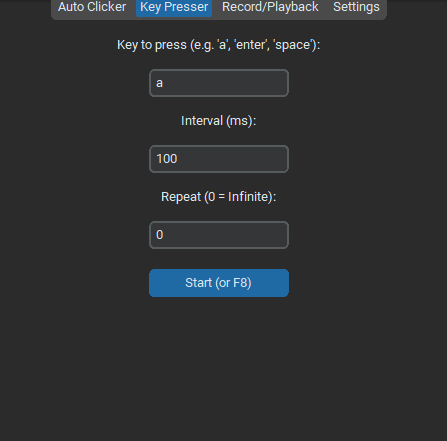

  
  
  # 🌌 ＡＵＴＯＭＡＴＥ ＳＴＵＤＩＯ 🌌
  ### **[ オートメート・スタジオ ]**
  
  *Công cụ Tự động hóa Bàn phím & Chuột — Khai mở giới hạn tối đa!* ⚡
  
  

    
    
    
  

---

## 🌸 「 Giới thiệu 」 (Introduction)

Chào mừng bạn đến với **Automate Studio**! 
Lấy cảm hứng từ không gian tương lai của Cyberpunk kết hợp phong cách Mecha Anime Nhật Bản, phần mềm được tạo ra không chỉ để giúp bạn "treo máy" hay tự động hóa các thao tác nhàm chán, mà còn biến góc làm việc của bạn trở thành một hệ thống điều khiển hiện đại và đậm chất nghệ thuật.

---

## ⚔️ 「 Bảng Kỹ Năng & Công Nghệ 」 (Features)

### 🗡️ Kỹ năng 1: Auto Clicker (Cuồng Phong Trảo)
* **Đa mục tiêu:** Hỗ trợ tự động nhấp chuột **Trái**, **Phải**, **Giữa**.
* **Đòn đánh linh hoạt:** Lựa chọn giữa **Click đơn (Single)** hoặc **Click đúp (Double)**.
* **Tốc độ ánh sáng:** Tùy chỉnh độ trễ (Interval) xuống hàng mili-giây với tốc độ phản hồi tức thì.
* **Ngụy trang (Random Delay):** Thêm khoảng trễ ngẫu nhiên để mô phỏng thao tác của người thật, giúp né tránh hệ thống phát hiện Auto của game. 🛡️
* **Tụ lực (Hold Mode):** Chế độ nhấn giữ chuột (Hold) thay vì nhấp liên tục cho các mục đích đặc biệt.

### 🎥 Kỹ năng 2: Thuật Sao Chép (Record & Playback)
* **Ghi nhớ (Record):** Kích hoạt "Sharingan" để ghi lại chính xác 100% mọi đường di chuột, cú nhấp chuột và nhịp gõ phím của bạn.
* **Tái hiện (Playback):** Lặp lại hoàn hảo kịch bản đã ghi hình. Hỗ trợ thiết lập số vòng lặp (Loops) tùy chỉnh hoặc lặp vô hạn. ♾️
* **🔥 Tương thích TinyTask (.REC):** 
  * **Đọc file .rec:** Khả năng giải mã và phát lại siêu chuẩn xác các file kịch bản `.rec` của phần mềm **TinyTask** nổi tiếng.
  * **Lưu bí tịch song song:** Hỗ trợ lưu bản ghi hình ra cả định dạng `.rec` (để dùng chung với TinyTask) và định dạng `.json` hiện đại của Automate Studio!

### 🎨 Nội tại: Thẩm Mỹ Bậc Thầy
* **Giao diện Hắc Ám (Dark Mode):** Tông màu xám đen kết hợp các đường viền phát sáng Neon Xanh/Tím chuẩn phong cách Cyber-Anime.
* **Thông báo nổi (Popup):** Các thông báo trạng thái bật lên êm ái ở góc phải màn hình, tựa như hệ thống AI hỗ trợ chiến thuật cho người dùng.
* **Lưu giữ ký ức:** Trí tuệ nhân tạo tự động ghi nhớ phím tắt (Hotkey) và toàn bộ thiết lập cuối cùng. Mở phần mềm lên là sẵn sàng chiến đấu!

---

## 📜 「 Hướng dẫn Tân thủ 」 (How to use)

> **Hệ thống:** *"Bạn đã sẵn sàng kết nối vào không gian tự động hóa chưa?"*

1. **📥 Tải trang bị:** Vào kho chứa trên Github, tải toàn bộ thư mục **`dist/AutoClickerPro`** về máy. *(Lưu ý quan trọng: Hãy tải nguyên cả thư mục, không tải lẻ file .exe để tốc độ khởi động nhanh như chớp!)*
2. **🚀 Khởi động:** Mở thư mục vừa tải, kích đúp vào **`AutoClickerPro.exe`**.
3. **⚙️ Vận hành:** 
   * Tại **Tab Auto Clicker**: Gắn phím tắt (Hotkey) tùy ý và bấm Bắt đầu (hoặc dùng chính phím tắt trên bàn phím).
   * Tại **Tab Record / Playback**: Gắn phím tắt, bấm Record để bắt đầu ghi hình thao tác, sau đó bấm Play để phần mềm tự động thực thi. Bạn có thể nhấn **Load** để chọn file `.rec` từ TinyTask hoặc `.json` để chạy ngay kịch bản có sẵn!

---

## 🛡️ 「 Khế Ước Bảo Mật 」 (Security)

> **Cảnh báo từ hệ thống an ninh:** *"Dữ liệu của bạn thuộc về riêng bạn."*

* **Hoạt động 100% Offline:** Automate Studio không yêu cầu kết nối mạng, không gửi bất kỳ dữ liệu thao tác chuột hay bàn phím nào ra bên ngoài.
* **Lưu trữ nội bộ:** Mọi kịch bản ghi hình đều được lưu thành file trực tiếp trên ổ cứng của bạn. Đảm bảo an toàn tuyệt đối 100%!

---

  <b>✨ Chúc bạn có những trải nghiệm tuyệt vời cùng Automate Studio! ✨</b>
   
  <i>Made with ❤️ by SDJ9</i>

